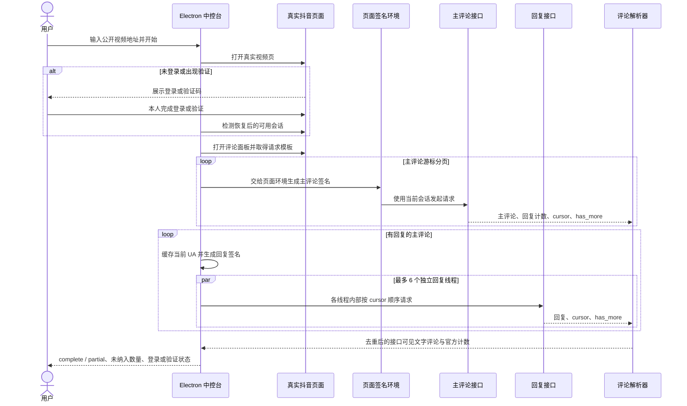

# 抖音评论接口签名与可见分页采集报告

> 分析日期：2026-09-20
> 报告类型：JS/Web 签名逆向（`flavor = null`）
> 项目：抖音带货中控台
> 验证状态：真实登录态端到端验证通过

## 1. 执行摘要

本次工作将视频评论采集流程调整为“用户先在真实抖音页面完成登录，程序再请求评论接口”。采集不依赖滚动评论区，也不暴露速度模式；点击“读取全部评论”后直接对主评论和评论回复执行游标分页。主评论保持签名所需的串行顺序，彼此独立的回复线程采用最多 6 路并发，遇到限制并恢复后自动按 `6 → 3 → 1` 降速。

2026-09-20 最终口径只采集含正常文字的评论。解析器会保留“图片或视频附件 + 文字”的文字内容，但忽略纯表情包、纯图片、纯视频和真正空评论。一次完整诊断中接口返回 93 个无文字主评论 ID 和 13 个无文字回复 ID，这 106 条均未进入线索库；最终独立采集得到 522 条文字主评论和 147 条文字回复，共 669 条，观察到 106 个评论响应页，均速 9.87 条/秒。应用内端到端复测得到 515 条主评论和 127 条回复，共 642 条，观察到 104 个响应页，均速 10.1 条/秒。目标作品官方评论计数为 970，界面将与文字评论数的差额标记为“未纳入”，其中包括按要求过滤的无文字内容，也可能包括已删除、审核折叠或权限不可见的评论。

作品页同时显示 8865 次收藏；该数值不是评论数。当前评论计数为 970。评论集合和可见性均会动态变化，因此 642、669 和墙钟时间都不作为未来运行的固定断言。

实现保留用户本人完成登录、验证码等交互的边界；运行时沿用登录页面的 Cookie 和浏览器环境，但代码、测试输出及本报告均不记录 Cookie、真实动态签名值或敏感请求头。AI 分析和私信内容仅生成草稿，发送动作仍由用户确认。

## 2. 范围与授权

| 项目 | 范围 |
|---|---|
| 授权来源 | 用户明确要求在其本机项目和由其本人登录的抖音会话内完成采集 |
| 目标 | 用户提供的抖音公开视频页面及其公开评论、公开回复 |
| 会话 | Electron 中打开真实抖音页面，登录和验证码由用户本人操作 |
| 数据字段 | 评论 ID、父评论 ID、用户 ID、抖音号、昵称、评论内容、评论时间、视频 ID、来源页 |
| 不在范围 | 绕过账号登录、保存或导出登录凭据、自动发送私信、读取非公开数据 |
| 网络策略 | 只复用当前页面已经建立的登录态和浏览器环境；主评论按游标串行，回复线程受控并发并支持自适应降速 |

本报告未建立独立 case 目录，因此 Scope、Evidence、Finding、Path 和 Timeline 直接嵌入本文。所有复现命令均在项目根目录执行。

## 3. 目标与结果

目标视频：`https://www.douyin.com/video/7675505205047348543`

| 指标 | 结果 |
|---|---:|
| 作品页收藏数（非评论数） | 8865 |
| 官方评论计数 | 970 |
| 本次文字主评论 | 515 |
| 本次文字回复 | 127 |
| 本次文字评论 | 642 |
| 本次未纳入 | 328 |
| 观察到的评论响应页 | 104 |
| 最终界面均速 | 10.1 条/秒 |
| 最终状态 | `partial` |
| 是否还有下一页 | `false` |
| 是否需要滚动评论区 | 否 |

分页结束判定必须同时满足：主评论分页到 `has_more=0`、每个已发现回复线程分页到 `has_more=0`、没有直接请求失败。只有文字评论数达到官方评论计数时才返回 `complete`；分页全部结束但仍小于官方计数时返回 `partial`，并同时给出 `officialCommentCount` 和 `unavailableCommentCount`。界面的“未纳入”表示官方计数与已采集文字评论的差额，不再表述为全部由接口漏返。`hasMore=false` 只表示接口没有下一页。任何游标停滞、页数或评论数达到上限、登录失效或验证拦截也不会误报完整。

## 4. 请求链路



## 5. 实现说明

### 5.1 先登录，再采集

`videoCommentCollector.ts` 先导航到真实视频页，检测页面或接口是否要求登录、验证码或安全验证。遇到限制时，采集器等待用户在该窗口内完成交互；限制解除后才打开评论面板并开始接口分页。接口返回 `401`、`403`、`429` 或限制型响应体时，也会回到同一交互恢复流程。

登录会话由 Electron 持久化在应用数据目录中，报告不展示其内容。请求在页面上下文中使用 `credentials: 'include'`，因此沿用该页面的会话，而不是复制或打印 Cookie。

### 5.2 主评论签名

主评论请求使用 `/aweme/v1/web/comment/list/`。采集器先清理上一页的易变签名参数，再更新 `aweme_id`、`cursor`、`count` 等分页参数，随后让抖音页面现有脚本生成新的 `a_bogus`。这条路径保持页面运行时与签名环境一致。

### 5.3 回复签名

回复请求使用 `/aweme/v1/web/comment/list/reply/`，参数切换为 `item_id`、`comment_id`、`cursor`、`count` 和 `cut_version=1`。实测主评论的签名分支不能直接复用于回复接口；回复需要独立参数分支 `[0, 1, 8]`。

`replyABogus.ts` 实现了确定性的 TypeScript 回复签名器，包括双重 SM3、UA 处理、RC4、字段编排和自定义 Base64。每次采集只读取一次当前登录页面的真实 `navigator.userAgent` 并供全部回复请求复用，避免固定 UA 与浏览器环境不一致，也消除逐页跨进程读取开销。

### 5.4 可见分页与字段解析

主评论从 `cursor=0` 开始，直到 `has_more=0`。解析每页时同时收集有回复的主评论 ID；主评论结束后，对每个回复线程从 `cursor=0` 独立分页到 `has_more=0`。采集器每批最多推进 6 个回复线程，但单个线程的下一页必须等待本线程上一页返回的新 cursor，因此不会打乱线程内顺序。整个过程不通过滚轮触发下一页。

记录按评论 ID 去重。解析器只接受非空文字；纯表情包、纯图片、纯视频和真正空评论被忽略。若评论同时包含附件和文字，则保留正常文字并统一为：

```ts
{
  commentId,
  parentCommentId,
  isReply,
  userId,
  douyinId,
  nickname,
  comment,
  createdAt,
  videoId,
  sourceUrl,
}
```

抖音号优先取公开的 `unique_id`，不存在时回退到 `short_id`。回复记录通过 `parentCommentId` 与主评论关联。

### 5.5 直接采集与限制恢复

界面只有一条直接采集路径。主评论请求间隔为 120–300 ms，每 40 次暂停 1.5 秒；回复请求间隔为 180–400 ms，每 48 次暂停 2 秒，最多同时推进 6 个彼此独立的回复线程。

遇到接口 `401`、`403`、`429` 或限制型响应时，采集器会保留每个未完成线程的 cursor，等待用户在真实抖音页面完成登录或验证。恢复后节流等级加一：回复并发从 6 降到 3，再降到 1；基础等待按等级翻倍。这样不会从头重抓已经完成的回复线程。

本次实测总耗时包含页面导航、模板发现、主评论签名、全部可见分页、解析和回复采集。

### 5.6 实时展示、持久化与 AI 筛选

采集器每解析一个接口页就通过带 `requestId` 的 IPC 进度事件发送本页新增评论；获客线索页收到事件后立即去重入库并更新阶段、累计条数、主评论/回复数量、接口页数和从任务启动开始计算的平均速度。最终结果仍会再执行一次兜底合并，确保迟到事件或界面重载不会漏数。

线索存储容量由 5000 条提升到 100000 条，并从同步 `localStorage` 迁移到 IndexedDB。内存仍逐页更新，持久化写入以 750 ms 合并，避免大评论区每页都重复序列化整个数据集。持久化版本迁移会删除旧数据中的 `[表情评论]`、`[图片评论]` 和 `[视频评论]` 占位记录，导入与实时入库也拒绝这些占位项。列表最多同时渲染 500 条，搜索、意向筛选、全选、导出和批量 AI 筛选仍覆盖全部已保存记录。

### 5.7 状态判定

采集器区分 `complete`、`partial`、`empty`、`login_required` 和 `verification_required`。主评论响应顶层的 `total` 被记录为 `officialCommentCount`，官方计数减去实际文字评论数后的非负差值被记录为 `unavailableCommentCount`，界面名称为“未纳入”。该差值包含主动过滤的无文字内容，也可能包含接口未公开返回的记录。所有游标正常结束时 `hasMore=false`；若差值仍大于零，状态保持 `partial`。已成功取得可用评论后，页面晚出现的通用验证文案不再覆盖真实接口结果；只有评论为空或直接请求失败时，页面文本才作为限制状态的后备证据。

## 6. Evidence

### E-001

- title: 回复签名 TypeScript 实现
- observed_at: 2026-09-20
- source_type: file
- source_ref: `electron/main/platforms/douyin/replyABogus.ts`
- content_hash: `9AB9126FB4E1AE36C18234BF8644D4CAEC955F10FFE202E7E0D17F44F34F5A98`
- artifact_path: `electron/main/platforms/douyin/replyABogus.ts`
- repro_command: `pnpm exec tsx scripts/reply-a-bogus-smoke.ts`
- raw_excerpt: 固定 query、UA、时间和随机数时，TypeScript 与 Python 参考实现一致；输出 `signatureLength=161`、`passed=true`。
- linked_workitem: n/a
- supersedes: none

### E-002

- title: 登录态评论采集器
- observed_at: 2026-09-20
- source_type: file
- source_ref: `electron/main/platforms/douyin/videoCommentCollector.ts`
- content_hash: `EBF64409240064876F212B0BEFDF4B6F572F20FADEDB814CEA19D3DCA2BFF395`
- artifact_path: `electron/main/platforms/douyin/videoCommentCollector.ts`
- repro_command: `pnpm exec tsx scripts/video-comment-parser-smoke.ts`
- raw_excerpt: 主评论与回复 URL 构造、游标更新、仅文字记录解析、去重、官方计数和未纳入差值断言通过；纯表情、纯图片、纯视频被过滤，附件同时带文字时保留文字。
- linked_workitem: n/a
- supersedes: none

### E-003

- title: 真实登录态端到端采集结果
- observed_at: 2026-09-20
- source_type: log
- source_ref: 本机 Electron 开发会话的脱敏结果
- content_hash: n/a
- artifact_path: n/a
- repro_command: `pnpm exec tsx scripts/video-comment-smoke.ts "https://www.douyin.com/video/7675505205047348543"`
- raw_excerpt: 无文字结构诊断确认 93 个无文字主评论 ID 和 13 个无文字回复 ID。最终独立复测返回 `officialCommentCount=970`、`comments=669`、`rootComments=522`、`replies=147`、`pagesObserved=106`、`unavailableCommentCount=301`、`9.87 条/秒`；应用内复测返回 `comments=642`、`rootComments=515`、`replies=127`、`pagesObserved=104`、`10.1 条/秒`。所有分页到 `has_more=0`，最终均为 `status=partial`、`hasMore=false`。
- linked_workitem: n/a
- supersedes: none

### E-004

- title: 类型检查、格式检查、构建和 UI 烟测
- observed_at: 2026-09-20
- source_type: command
- source_ref: 项目根目录命令输出
- content_hash: n/a
- artifact_path: n/a
- repro_command: `pnpm exec biome check electron/main/platforms/douyin/videoCommentCollector.ts src/hooks/useLeadStore.ts src/pages/LeadCenter/index.tsx scripts/video-comment-smoke.ts scripts/video-comment-parser-smoke.ts scripts/lead-center-ui-smoke.ts; pnpm exec tsc --noEmit; pnpm exec tsx scripts/reply-a-bogus-smoke.ts; pnpm exec tsx scripts/video-comment-parser-smoke.ts; pnpm exec tsx scripts/lead-center-ui-smoke.ts --status; pnpm build`
- raw_excerpt: 格式检查、TypeScript 检查、签名向量、仅文字解析烟测、UI 烟测、Vite 生产构建和 Electron NSIS 安装包构建通过；解析烟测返回 `passed=true`，UI 截图检查返回 `mediaPlaceholders=0` 且无水平溢出。
- linked_workitem: n/a
- supersedes: none

### E-005

- title: 官方计数与接口差额页面截图
- observed_at: 2026-09-20
- source_type: screenshot
- source_ref: `screenshot/lead-center-text-comments-only.png`
- content_hash: `6F41E1051F6E575EC74DC11C044A93705344DDA6D034A99EC20C50D96A85DD02`
- artifact_path: `screenshot/lead-center-text-comments-only.png`
- repro_command: 通过 Playwright 连接本机 Electron CDP，在 `/#/lead-center` 页面执行全页截图。
- raw_excerpt: 桌面布局无重叠且无水平溢出；页面显示 `采集结束`、`官方计数 970 条`、`已读取 642 条`、`未纳入 328 条`、`10.1 条/秒`、`515 / 127` 和 `104` 页；评论表格中 `[表情评论]`、`[图片评论]`、`[视频评论]` 均为 0。
- linked_workitem: n/a
- supersedes: none

### E-006

- title: 包含仅文字评论口径的 Windows 安装程序
- observed_at: 2026-09-20
- source_type: file
- source_ref: `release/1.6.3/oba-live-tool_1.6.3_windows_x64.exe`
- content_hash: `F219DF7FDB0CAB2E753794C32DBE4A2FA601D367F52CB42AAC31E5628333125D`
- artifact_path: `release/1.6.3/oba-live-tool_1.6.3_windows_x64.exe`
- repro_command: `pnpm build`
- raw_excerpt: `electron-builder` 完成 x64 NSIS 安装程序构建；安装包大小 82409647 字节。生产前端包与 Electron 主进程包包含仅文字过滤、旧占位记录迁移和“未纳入”状态文案。
- linked_workitem: n/a
- supersedes: none

### E-007

- title: 线索入库与旧数据迁移的文字过滤
- observed_at: 2026-09-20
- source_type: file
- source_ref: `src/hooks/useLeadStore.ts`
- content_hash: `F8E68DCE79C08E3DEE89A5163467B9B5D475E469EC2AE9B7CCE3AB373A48F4A3`
- artifact_path: `src/hooks/useLeadStore.ts`
- repro_command: `pnpm exec biome check src/hooks/useLeadStore.ts && pnpm exec tsc --noEmit`
- raw_excerpt: 导入和视频评论入库均要求非空正常文字；持久化版本升级为 1，迁移时删除旧的 `[表情评论]`、`[图片评论]` 和 `[视频评论]` 占位线索。
- linked_workitem: n/a
- supersedes: none

## 7. Findings

### F-001

- title: 评论采集必须在用户完成真实登录后开始
- severity: n/a_re
- category: design
- status: validated
- evidence_ids: [E-002, E-003]
- location: `electron/main/platforms/douyin/videoCommentCollector.ts:673`
- impact: 避免游客态或失效会话在评论接口阶段直接被拦截，并保留用户处理验证码的入口。
- confidence: high
- repro_steps: 打开获客线索页，提交公开视频地址，在弹出的真实抖音页面完成登录；登录恢复后观察采集继续。
- remediation: n/a，属于已实现的交互约束。

### F-002

- title: 回复接口需要独立签名分支
- severity: n/a_re
- category: reverse_algo
- status: validated
- evidence_ids: [E-001, E-003]
- location: `electron/main/platforms/douyin/replyABogus.ts:153`
- impact: 修复回复接口 HTTP 200 但正文为空的问题，使回复可以正常返回 JSON 并分页。
- confidence: high
- repro_steps: 运行确定性签名测试，再在已登录页面采集含回复的视频。
- remediation: n/a，属于已还原并接入的签名逻辑。

### F-003

- title: 无需滚动即可读完接口可见的主评论和回复
- severity: n/a_re
- category: design
- status: validated
- evidence_ids: [E-002, E-003]
- location: `electron/main/platforms/douyin/videoCommentCollector.ts:1015`
- impact: 能够按接口游标读完当前登录态可枚举的评论树，避免依赖可见区域、滚轮速度或 DOM 虚拟列表；同时不会再把官方计数与已采集文字评论的差额误报为已采集内容。
- confidence: high
- repro_steps: 在登录态运行目标视频采集，确认所有分页到 `has_more=0`；当实际返回数小于官方计数时结果为 `partial`、`hasMore=false`，并显示准确差值。
- remediation: n/a，属于已实现的数据路径。

### F-004

- title: 回复线程并发可显著缩短可见评论采集的墙钟时间
- severity: n/a_re
- category: design
- status: validated
- evidence_ids: [E-002, E-003, E-004, E-005]
- location: `electron/main/platforms/douyin/videoCommentCollector.ts:651`
- impact: 在不破坏单线程 cursor 顺序的前提下，同时推进最多 6 个回复线程；最终两次真实运行分别读取 669 条和 642 条文字评论，均速为 9.87 条/秒和 10.1 条/秒。在速度不变的纯估算下，1 万条约需 16 分 30 秒至 16 分 53 秒，实际耗时仍取决于接口分页、网络、可见集合和限制恢复。
- confidence: high
- repro_steps: 使用已登录会话点击“读取全部评论”，核对耗时、官方计数、实际返回数及差值；运行解析烟测核对 `6 → 3 → 1` 并发策略。
- remediation: n/a，属于已实现的性能策略。

### F-005

- title: 仅文字评论与未纳入差额逻辑已进入正式 Windows 安装包
- severity: n/a_re
- category: design
- status: validated
- evidence_ids: [E-004, E-006]
- location: `release/1.6.3/oba-live-tool_1.6.3_windows_x64.exe`
- impact: 用户重新安装或直接运行最新解包版本时，会获得与开发版一致的官方计数、文字评论数、未纳入数和 `partial` 状态；纯媒体评论不会以占位文字混入线索。
- confidence: high
- repro_steps: 运行 `pnpm build`，确认 NSIS 安装包生成，并在生产前端包与 Electron 主进程包中检索新状态文案。
- remediation: n/a，功能已构建进正式产物。

### F-006

- title: 线索库只保留正常文字评论
- severity: n/a_re
- category: design
- status: validated
- evidence_ids: [E-002, E-004, E-005, E-007]
- location: `electron/main/platforms/douyin/videoCommentCollector.ts:295`, `src/hooks/useLeadStore.ts:12`
- impact: 纯表情包、纯图片、纯视频和真正空评论不会进入线索库；媒体附件同时带正常文字时保留文字。升级后，旧数据中的三种媒体占位记录也会自动清除。
- confidence: high
- repro_steps: 运行解析烟测，确认四种无文字记录均被过滤、图片加文字记录保留；重新加载获客线索页，确认三种占位文本计数均为 0。
- remediation: n/a，过滤和迁移均已实现。

## 8. Path

### P-001

- title: 登录后读取公开视频的接口可见评论树
- path_type: callflow
- start: 用户在获客线索页提交公开视频地址
- goal: 返回当前登录态下接口可枚举的文字主评论和文字回复，并准确标记分页状态与官方计数差额
- steps:
  1. action: Electron 打开真实抖音视频页并检测登录或验证限制；evidence: E-002；finding: F-001
  2. action: 用户本人完成登录或验证码，采集器确认限制解除；evidence: E-003；finding: F-001
  3. action: 页面环境为主评论请求生成实时签名并按 cursor 分页；evidence: E-002；finding: F-003
  4. action: 采集器缓存页面 UA，使用回复专用签名分支并发推进独立回复线程，各线程内部保持 cursor 串行；evidence: E-001, E-002；finding: F-002, F-004
  5. action: 解析器提取用户字段、文字内容和父子关系并按评论 ID 去重；纯媒体和空评论被过滤，附件带文字时保留文字；evidence: E-002, E-007；finding: F-003, F-006
  6. action: 若出现限制则等待用户恢复并按 `6 → 3 → 1` 降速，从未完成 cursor 续跑；evidence: E-002；finding: F-001, F-004
  7. action: 所有主评论及回复均到 `has_more=0` 后返回 `hasMore=false`；若文字评论数小于官方计数，则返回 `partial` 并展示未纳入差额；evidence: E-003, E-005；finding: F-003, F-006
- residual_risks: 抖音官方计数包含接口不向当前会话返回的记录，且可枚举集合会动态变化；接口参数、签名算法或风控策略发生版本更新时，需要重新做兼容验证；登录失效或验证未完成时应保持可恢复状态，不应伪装为完整结果。

## 9. 关键时间线

| 日期 | 事件 | 证据 |
|---|---|---|
| 2026-09-20 | 确认流程必须先展示真实抖音页面，由用户完成登录 | E-002 |
| 2026-09-20 | 定位主评论与回复接口的签名分支差异 | E-001 |
| 2026-09-20 | TypeScript 回复签名与 Python 参考向量一致 | E-001 |
| 2026-09-20 | 回复接口恢复 JSON 正文并正常分页 | E-003 |
| 2026-09-20 | 早期串行策略读完接口分页，得到 519 条主评论和 136 条回复 | E-003 |
| 2026-09-20 | 接入 6 路回复并发和 `6 → 3 → 1` 自适应降速 | E-002 |
| 2026-09-20 | 最终口径改为只保留正常文字；诊断确认 93 个无文字主评论 ID 和 13 个无文字回复 ID 均被过滤 | E-002, E-003, E-007 |
| 2026-09-20 | 独立复测得到 522 条文字主评论和 147 条文字回复，共 669 条、106 页，均速 9.87 条/秒 | E-003 |
| 2026-09-20 | 应用内复测得到 515 条文字主评论和 127 条文字回复，共 642 条、104 页，均速 10.1 条/秒 | E-003, E-005 |
| 2026-09-20 | 确认作品的 8865 是收藏数，官方评论计数为 970；所有游标结束后正确返回 `partial` 与 `hasMore=false` | E-003, E-005 |
| 2026-09-20 | 获客线索页显示官方计数、文字评论数、未纳入数、实时均速、主评论/回复和接口页数；布局无重叠，媒体占位项为 0 | E-005 |
| 2026-09-20 | 格式、类型、构建及 UI 烟测通过 | E-004 |
| 2026-09-20 | 重新生成 Windows x64 解包程序和 NSIS 安装程序，正式产物包含评论计数差额逻辑 | E-006 |

## 10. 复现与验证

先启动开发版应用，并在应用打开的真实抖音窗口中由用户本人完成登录。随后在项目根目录执行：

```powershell
pnpm exec biome check shared/types.d.ts shared/ipcChannels.ts shared/electron-api.d.ts electron/main/platforms/IPlatform.ts electron/main/services/AccountSession.ts electron/main/platforms/douyin/index.ts electron/main/ipc/videoComments.ts electron/main/platforms/douyin/videoCommentCollector.ts src/hooks/useLeadStore.ts src/pages/LeadCenter/index.tsx scripts/video-comment-smoke.ts scripts/video-comment-parser-smoke.ts scripts/lead-center-ui-smoke.ts
pnpm exec tsc --noEmit
pnpm exec tsx scripts/reply-a-bogus-smoke.ts
pnpm exec tsx scripts/video-comment-parser-smoke.ts
pnpm exec tsx scripts/lead-center-ui-smoke.ts --status
pnpm build
```

若要再次执行真实采集，在确认登录态可用后运行：

```powershell
pnpm exec tsx scripts/video-comment-smoke.ts "https://www.douyin.com/video/7675505205047348543"
```

预期签名测试为 `passed=true`。分页全部结束时应为 `hasMore=false`；若文字评论数小于 `officialCommentCount`，最终状态应为 `partial`，且 `unavailableCommentCount` 等于两者差值。本次最终两次快照分别为 669 条和 642 条文字评论，官方计数均为 970；公开视频评论数量与接口可见性会随时间变化，不应作为未来运行的固定断言。需要逐页诊断元数据时，可在真实采集命令末尾添加 `--evidence`。

## 11. 遗留风险与维护点

- 抖音更新网页签名或接口参数后，确定性签名测试可能仍通过旧向量，但真实接口会失败；两类验证都需要保留。
- 登录状态具有时效性。失效时应重新展示真实页面让用户登录，不应尝试隐藏或绕过登录步骤。
- 目标视频评论持续变化，同一视频的数量和页数不是稳定常量。游标与 `has_more` 只能证明接口分页结束；是否达到官方计数还必须比较 `officialCommentCount` 和实际去重记录数。
- 官方计数可能包含已删除、审核折叠或当前账号权限不可见的记录；公开 Web 接口不能保证返回计数中的每一条。
- 直接采集仍受服务端分页上限、网络往返、页面签名耗时和平台限制约束，不能把 1 万条评论承诺为瞬时完成；大量数据应以实际分页数和是否触发降速估算。
- 当前发送侧保持人工确认。若后续接入 AI 分析，应记录分析结论和草稿，但不应直接自动批量发送。

## 12. 文件清单

| 文件 | 用途 |
|---|---|
| `electron/main/platforms/douyin/replyABogus.ts` | 回复接口 `a_bogus` 的 TypeScript 实现 |
| `electron/main/platforms/douyin/videoCommentCollector.ts` | 登录等待、主评论/回复分页、解析与完成状态 |
| `shared/types.d.ts` | 视频评论采集参数和结果类型 |
| `src/hooks/useLeadStore.ts` | 仅文字线索入库、旧媒体占位记录迁移和 IndexedDB 持久化 |
| `src/pages/LeadCenter/index.tsx` | 直接采集入口和采集状态展示 |
| `scripts/reply-a-bogus-smoke.ts` | 回复签名确定性向量测试 |
| `scripts/video-comment-parser-smoke.ts` | 评论解析、URL 构造、等待和并发策略测试 |
| `scripts/video-comment-smoke.ts` | 真实采集和耗时输出烟测 |
| `scripts/lead-center-ui-smoke.ts` | 获客线索页面和真实采集入口烟测 |
| `screenshot/lead-center-text-comments-only.png` | 官方计数、文字评论数、未纳入差额和媒体占位项为 0 的 UI 验证截图 |
| `release/1.6.3/oba-live-tool_1.6.3_windows_x64.exe` | 包含仅文字评论口径与旧数据迁移的 Windows x64 安装程序 |

本报告不包含 Cookie、真实动态签名、账号标识或敏感请求头值。
